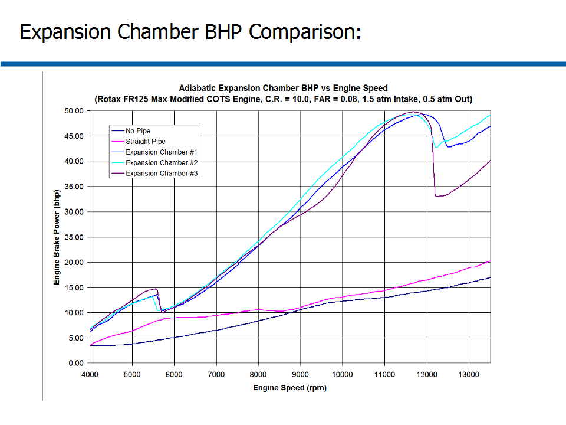

# ========================================
# Choked 3-Stage 2-Stroke ICE Expansion Chamber Performance Analysis:
# ========================================

## I. Overview of Choked 3-Stage 2-Stroke ICE Expansion Chamber Design:

## 
## 
## II. Overview of Modified COTS IC Engine:

## 
## 
## III. Example Application of Choked 3-Stage Expansion Chamber Design:

## 
## 
## IV. Comparison of BHP Performance of Different Exhaust System Designs:

## 
## 
## V. Comparison of BSFC Performance of Different Exhaust System Designs:

## 
## 
## VI. Comparison of Exhaust-to-Intake Pressure Ratio vs Engine Speed of Different Exhaust System Designs:

## 
## 
## VII. Comparison of Exhaust Outlet Total-Temperature of Different Exhaust System Designs:

## 
## 
## VIII. Comparison of Exhaust Outlet Total-Pressure of Different Exhaust System Designs:

## 
## 
## IX. Comparison of Exhaust Outlet Mass-Flow-Rate of Different Exhaust System Designs:

## 
## 
## X. Comparison of Exhaust Outlet Turbine Power of Different Exhaust System Designs:

## 
## *Notes: 
## 1. Turbomachinery Performance Data and Analysis performed using AxStream, SoftInWay Inc.
## 2. ICE Performance Data and Analysis performed using "GT-Suite", Gamma Technologies Inc.
